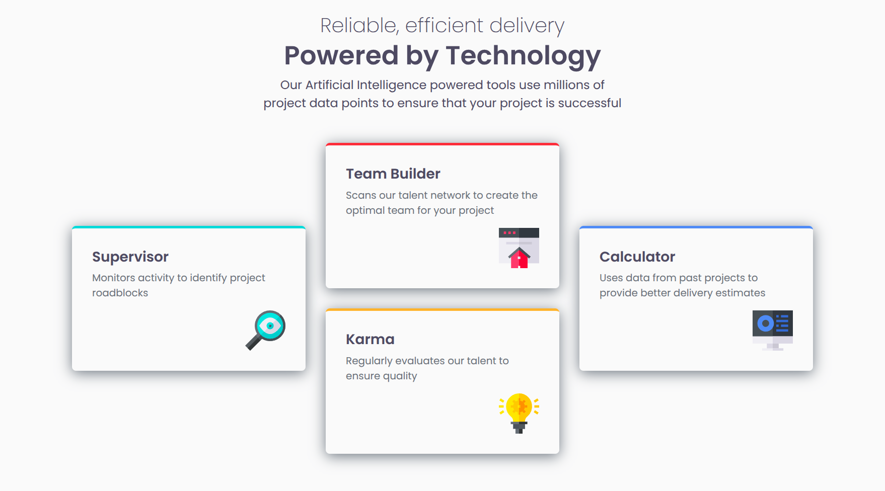

# Frontend Mentor - Product preview card component

This is a solution to the [Four card feature section coding challenge](https://www.frontendmentor.io/challenges/four-card-feature-section-weK1eFYK). Frontend Mentor challenges help you improve your coding skills by building realistic projects. 

## Table of contents

- [Overview](#overview)
  - [The challenge](#the-challenge)
  - [Screenshot](#screenshot)
  - [Links](#links)
- [My process](#my-process)
  - [Tools used](#tools-used)

## Overview

### The challenge

The challenge is to build out this feature section and get it looking as close to the design as possible.

You can use any tools you like to help you complete the challenge. So if you've got something you'd like to practice, feel free to give it a go.

Your users should:

- View the optimal layout for the site depending on their device's screen size

### Screenshot

### Links

- Solution URL: [Frontend Mentor](https://www.frontendmentor.io/solutions/four-card-feature-section-challenge-using-bootstrap-studio-VkYtWKq8Lv)
- Live Site URL: [CloudFlare Pages](https://four-card-feature-section-5n2.pages.dev/)

## My process

1. Visually designed in Bootstrap Studio using a Mobile-first workflow
2. Sass for custom CSS
3. CSS Grid for layouts
3. HTML and assets exported and edited in VS Code

### Tools used

- [Bootstrap](https://getbootstrap.com/) - CSS Framework
- [Sass](https://sass-lang.com/) - CSS preprocessor
- [Bootstrap Studio](https://bootstrapstudio.io/) - Cross-Platform Design Software
- [GIMP](https://www.gimp.org/) - Free & Open Source Image Editor